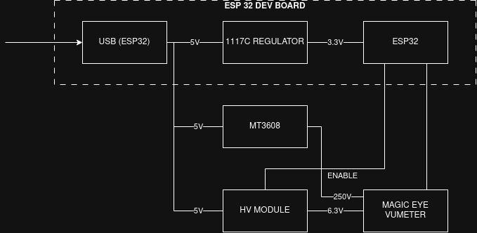
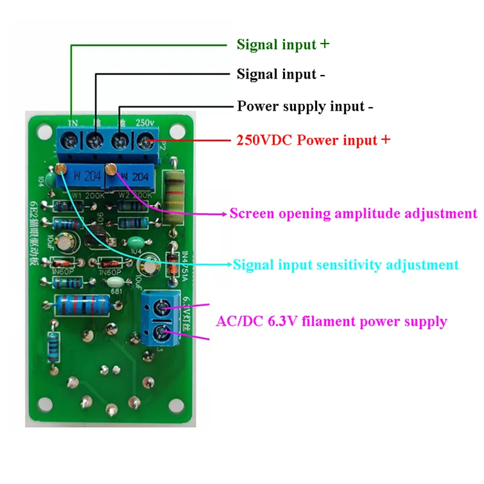
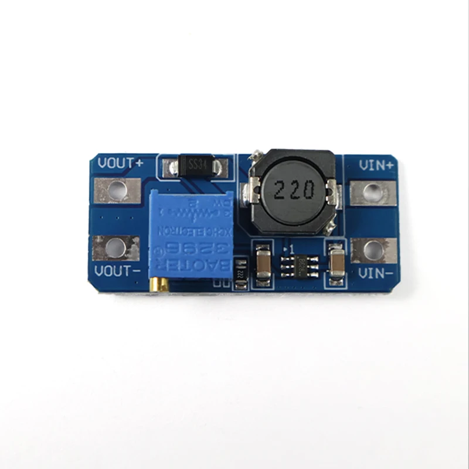

# ESP32 Magic Eye Monitor

**A hardware project that bridges 1950s vacuum tube technology with modern WiFi networking.**

This repository contains the ESP32 firmware and Python host scripts to repurpose a vintage **Magic Eye** tube (typically an EM34, 6E5, or EM84) as a real-time, wireless display. The project supports two independent operating modes:

- 📊 **CPU Monitor** — The eye opens and closes in response to your PC's CPU load.
- 🎵 **Audio VU Meter** — The eye dances to the music playing on your computer in real-time.

Once flashed, the ESP32 connects to your WiFi network with a fixed static IP and needs no USB cable — power it from any 5V adapter and let it run indefinitely.

---

## Table of Contents

1. [How It Works](#how-it-works)
2. [Hardware Components](#hardware-components)
3. [Wiring & Power](#wiring--power)
4. [Firmware Setup](#firmware-setup)
5. [Mode 1: CPU Monitor](#mode-1-cpu-monitor)
6. [Mode 2: Audio VU Meter](#mode-2-audio-vu-meter)
7. [Hardware Calibration](#hardware-calibration)
8. [Troubleshooting & Brownouts](#troubleshooting--brownouts)
9. [Safety Guidelines](#safety-guidelines)

---

## How It Works

Magic Eye tubes require a variable negative voltage on their control grid to move the shadow. Hobbyist Magic Eye driver boards (common on AliExpress/eBay) include an AC-coupling capacitor and a peak-detector circuit, so they are designed to be driven by a standard audio signal — not a static DC voltage.

The ESP32 solves this by generating a **250 Hz square wave** on its DAC output (GPIO 25). The amplitude of the wave is proportional to the metric being monitored (CPU load or audio volume). The driver board's peak detector rectifies and smooths this signal into a stable control voltage for the tube's grid.



### Smart Power-On Sequence

To prevent reboots on startup, the ESP32 boots into a low-power **standby state** with the high-voltage booster OFF. It connects to WiFi cleanly, then only activates the HV booster the moment the **first UDP packet** arrives from the host script. This eliminates the current spike that would otherwise cause a brownout reset.

---

## Hardware Components

| Component | Description | Notes |
|---|---|---|
| **ESP32 Dev Board** | Dual-core MCU with WiFi and 8-bit DAC | Standard 30-pin or 38-pin module |
| **Magic Eye VU Module** | Driver board with tube socket (EM34, 6E5, or EM84) | Search "Magic Eye VU level meter" on AliExpress |
| **MT3608 DC-DC Booster** | Steps up 5V to 6.3V for the tube's filament/heater | Adjust output to exactly 6.3V before use |
| **HV DC-DC Boost Module** | 5V input → ~250V DC output for the tube's anode/plate | Controlled via ESP32 GPIO |
| **5V/1A+ Power Supply** | Powers the entire circuit | A USB phone charger works well |
| **470µF–1000µF Capacitor** | Bulk capacitance across the 5V rail | Strongly recommended to prevent brownouts |

---

## Wiring & Power



### Pinout Table

#### 1. Filament Power (MT3608 → Tube)



> Before connecting to the tube, power up the MT3608 alone and **adjust its trimmer potentiometer until the output reads exactly 6.3V**. Overvoltage will permanently burn the tube's filament!

| MT3608 Pin | Connect To |
|---|---|
| IN+ | 5V Power Supply |
| IN− | GND |
| OUT+ | Tube Board `Vf+` |
| OUT− | GND |

#### 2. High-Voltage Booster (HV Module)

| HV Module Pin | Connect To | Notes |
|---|---|---|
| VIN / IN+ | 5V Power Supply | |
| GND / IN− | GND | |
| **ENABLE** | **ESP32 GPIO 4** | HIGH = Active; ESP32 controls this! |
| VOUT / HV+ | Tube Board `Va` | **~250V — Do not touch!** |
| GND OUT | GND | |

#### 3. Magic Eye VU Board Signal Interface

| VU Board Pin | Connect To | Description |
|---|---|---|
| Vf+ | MT3608 OUT+ | Heater filament (6.3V) |
| Vf− | GND | Heater return |
| Va | HV Boost VOUT | Anode/Target (~250V) |
| **IN_L** | **ESP32 GPIO 25** | Audio signal input (driven by DAC) |
| IN_R | Unconnected | Leave open |
| GND (Audio) | GND | Signal reference ground |

---

## Firmware Setup

The firmware is built using **PlatformIO**.

### Step 1: Configure Credentials (`secrets.h`)

Navigate to `firmware/cpu_monitor/src/` and create the file `secrets.h`. **This file is excluded from Git**, so your credentials will never be committed.

```cpp
#ifndef SECRETS_H
#define SECRETS_H

// --- WiFi Credentials ---
#define WIFI_SSID     "YOUR_WIFI_NETWORK_NAME"
#define WIFI_PASSWORD "YOUR_WIFI_PASSWORD"

// --- Static IP Configuration (Recommended) ---
// Uncomment the line below to assign a fixed IP to the ESP32.
// This lets you always reach the device at the same address
// without using the serial monitor.
#define USE_STATIC_IP

#ifdef USE_STATIC_IP
#define STATIC_IP   192, 168, 1, 135   // <-- change this to a free IP on your network
#define GATEWAY     192, 168, 1, 1
#define SUBNET      255, 255, 255, 0
#define PRIMARY_DNS 8, 8, 8, 8
#endif

#endif // SECRETS_H
```

> **Why Static IP?** Without it, the ESP32 gets a different DHCP address every time it boots, and you'd need to connect the USB cable to read the serial monitor to find it. With `USE_STATIC_IP` enabled, the IP is always the same and both host scripts can connect immediately.

### Step 2: Flash the Firmware

```bash
cd firmware/cpu_monitor/
pio run --target upload
```

After flashing, you can watch the boot sequence with:
```bash
pio device monitor
```

You should see:
```
[WIFI] Connected! IP address: 192.168.1.135
[UDP] Listening on port 4210
[STATUS] Standby active. Waiting for host...
```

Once the host script starts sending packets, you'll see:
```
[UDP] Packet received (level=142) - waking up from standby.
[STATUS] HV module state: ON
```

---

## Mode 1: CPU Monitor

The `monitor.py` script samples your system CPU load with `psutil` and streams it to the ESP32 40 times per second.

### Installation

```bash
cd host/cpu_monitor/
pip install -r requirements.txt
# or: pip install psutil
```

### Usage

```bash
python monitor.py --host 192.168.1.135 --verbose
```

The `--verbose` flag shows a live ASCII bar in your terminal:
```
CPU  42.3%  [########------------]  -> byte 108
```

### All Options

| Argument | Default | Description |
|---|---|---|
| `--host`, `-H` | *(required)* | ESP32 IP address |
| `--port`, `-p` | `4210` | UDP port (must match firmware) |
| `--interval`, `-i` | `0.1` | Seconds between samples |
| `--verbose`, `-v` | off | Print live CPU bar |

---

## Mode 2: Audio VU Meter

The `audio_monitor.py` script captures your PC's system audio in real-time, analyzes its volume, and streams it to the ESP32. The Magic Eye tube pulsates and dances to the music.

### Installation

```bash
cd host/audio_monitor/
pip install sounddevice numpy
```

On Fedora/RHEL you may also need:
```bash
sudo dnf install pipewire-utils
```

On Debian/Ubuntu:
```bash
sudo apt install libportaudio2
```

### Basic Usage

```bash
python audio_monitor.py --host 192.168.1.135 --verbose
```

### Routing System Audio (Linux with PipeWire / PulseAudio)

By default on Linux, Python captures from your microphone input. To capture the music actually playing on your PC, you need to redirect its audio source:

1. Start the script so it appears in the system audio mixer.
2. Open `pavucontrol` (install it with `sudo dnf install pavucontrol` / `sudo apt install pavucontrol`).
3. Go to the **Recording** tab.
4. Find the `python3 / ALSA Capture` entry.
5. Click the dropdown and select **"Monitor of [Your Sound Card]"** — for example, *"Monitor of Built-in Audio Analog Stereo"*.

From this moment on, all system audio (music, videos, notifications) is captured and sent to the Magic Eye tube.

### All Options

| Argument | Default | Description |
|---|---|---|
| `--host`, `-H` | `192.168.1.135` | ESP32 IP address |
| `--port`, `-p` | `4210` | UDP port |
| `--device`, `-d` | *(auto)* | Audio device index. Use `--list` to discover |
| `--gain`, `-g` | `1.0` | Software gain multiplier. Reduce (e.g. `0.2`) if the tube is always maxed out |
| `--min-val`, `-m` | `90` | Minimum output byte (0-255). Compensates for the diode drop on the VU board |
| `--db-min` | `-35.0` | Silence floor in dB (used when auto-range is off) |
| `--db-max` | `-10.0` | Loudness ceiling in dB (used when auto-range is off) |
| `--no-auto` | off | Disable auto-range (AGC). Uses fixed `--db-min` / `--db-max` instead |
| `--linear` | off | Use linear RMS scaling instead of logarithmic (dB) scaling |
| `--fps`, `-f` | `40` | Packets per second sent to the ESP32 |
| `--verbose`, `-v` | off | Print live volume bar with dynamic range info |
| `--list`, `-l` | — | List all available audio devices and exit |

### How the Volume Engine Works

The script uses three layers of signal processing to make the tube's movement feel natural and musical:

#### 1. RMS Metering
Each 25ms audio block is analyzed by computing its **Root Mean Square (RMS)** amplitude — the same principle used in professional audio equipment. The DC offset is removed first to eliminate interference from the sound card electronics.

#### 2. Envelope Follower (Ballistic Filter)
The raw RMS level is fed through a ballistic filter that simulates the physical inertia of an analog VU meter needle:
- **Fast Attack** — The level jumps up instantly on loud transients (kick drum hits, loud passages).
- **Slow Decay** — The level falls back slowly after the transient, giving that classic smooth "needle fall" motion.

#### 3. Adaptive Auto-Range (AGC)
This is the most important feature for natural-looking movement. Modern music is heavily compressed — the difference between the loudest and quietest moments in a song can be very small. Without auto-range, the tube would barely move.

The AGC continuously tracks the loudest peaks and softest valleys of the current audio in real-time, and **dynamically adjusts the mapping window** so that the full physical range of the tube is always used regardless of the song's overall volume.

```
Song 1: Loud rock track → AGC ceiling = -8 dB  → tube uses 100% range
Song 2: Soft jazz track → AGC ceiling = -18 dB → tube STILL uses 100% range
```

#### 4. Silence Gate (Pause Freeze)
When you pause the music, the volume drops below the silence threshold (`-45 dB`). The AGC is **frozen** — it does not try to adapt to the silence level. This means when you press play again, the calibration is exactly where it was before, and the tube responds instantly without a "warmup" period.

#### Diode Offset Compensation (`--min-val`)
The VU board contains a rectifier diode with a ~0.6V forward voltage drop. Any DAC signal below roughly `0.7V` (byte value ~55) simply cannot conduct through the diode and the tube does not respond at all, creating a "dead zone" at the bottom of the scale.

The `--min-val` parameter skips this dead zone: when audio is detected, the DAC output starts at `min-val` (default: `90`, which is ~1.15V) and scales up to `255` from there. The tube now uses its full physical range of motion instead of only the top portion.

---

## Hardware Calibration

The VU driver board has a small blue or yellow **trimmer potentiometer** (a tiny screw on the PCB). This controls the input sensitivity of the tube driver.

**To calibrate it:**
1. Start either host script with a high signal (CPU at 100%, or loud music with `--verbose` showing values near `255`).
2. Use a small screwdriver to slowly turn the trimmer.
3. **The goal:** When the terminal shows `255`, the two glowing green "petals" of the Magic Eye should just barely touch/close. When it shows `0`, the eye should be fully open.
4. Once set, you should never need to adjust it again.

> **Tip for the Audio VU Meter:** Calibrate with your typical listening volume — not the absolute maximum. This gives the best dynamic range during normal use.

---

## Troubleshooting & Brownouts

### Symptom: ESP32 Reboots Repeatedly on Power-Up

You will see this loop in the serial monitor:
```
Brownout detector was triggered
rst:0xc (SW_CPU_RESET),boot:0x13 (SPI_FAST_FLASH_BOOT)
```

**Root Cause:** The HV boost converter demands a large current spike when it starts up. If this spike, combined with the WiFi radio activity, drops the 5V supply below ~3.1V for even a fraction of a millisecond, the ESP32's hardware brownout detector fires and resets the chip.

**The firmware already mitigates this** by keeping the HV booster OFF during boot and WiFi connection, and only enabling it after the first UDP packet is received. If you still see brownouts, follow these hardware steps:

| Fix | How |
|---|---|
| ✅ Add a bulk capacitor | Solder a **470µF–1000µF / 10V** electrolytic capacitor directly across the ESP32's 5V and GND pins. This is the most effective fix. |
| ✅ Use a better power supply | A quality **5V / 1A+ USB adapter** is sufficient. Avoid powering from a laptop's USB port, which is often limited and shares bandwidth. |
| ✅ Use a short, thick USB cable | Long thin cables have significant series resistance that aggravates voltage sag. |
| ⚠️ Disable brownout in software | Not recommended. Disabling the brownout detector allows the MCU to execute code at unstable voltages, which can corrupt flash memory. |

### Symptom: Tube Does Not Move / Stays Fully Open

1. Check the serial monitor — is the HV booster `ON`? (`[STATUS] HV module state: ON`)
2. Is the Python script running and sending packets? (`python monitor.py --host ... --verbose`)
3. Is the trimmer potentiometer adjusted? An insensitive trimmer setting means the tube won't react to the ESP32's signal.
4. Is GPIO 25 connected to `IN_L` on the VU board?

### Symptom: Audio VU Bar is Always Maxed Out (value = 255)

The PipeWire/PulseAudio recording volume is probably at 100%, which saturates the input. Fix this with one of:
- Reduce `--gain` (e.g. `--gain 0.2` or `--gain 0.1`).
- Open `pavucontrol` → **Recording** tab → drag the volume slider for the Python process down to ~20–30%.

### Symptom: Audio VU Bar Has No Range (tiny movement near 255)

- Adjust the **trimmer potentiometer** on the VU board (see [Hardware Calibration](#hardware-calibration)). The board is probably calibrated for a line-level audio signal, not the ESP32's 3.3V DAC range.
- You do **not** need a 3.3V→5V level shifter. Level shifters for digital signals would destroy the analog waveform. The hardware solution is the trimmer adjustment.

---

## Safety Guidelines

> ⚠️ **HIGH VOLTAGE — READ BEFORE BUILDING**
>
> The HV boost module generates approximately **250V DC**. This voltage is lethal.
> - **Never** touch the circuit while it is powered.
> - **Never** adjust wiring, solder, or probe the HV section while powered.
> - Always house the HV module and tube socket inside a fully **insulated enclosure**.
> - After powering down, wait **at least 30 seconds** for capacitors to discharge before touching anything.
> - If in doubt, don't. Ask someone with electronics experience before proceeding.

---

## Project Structure

```
esp32magiceye/
├── firmware/
│   └── cpu_monitor/
│       └── src/
│           ├── main.cpp         # ESP32 firmware (WiFi, UDP, DAC, HV control)
│           ├── secrets.h        # ⚠️ LOCAL ONLY — WiFi credentials & static IP (gitignored)
│           └── secrets.h.example
├── host/
│   ├── cpu_monitor/
│   │   ├── monitor.py           # CPU load → ESP32 streamer
│   │   └── requirements.txt
│   └── audio_monitor/
│       ├── audio_monitor.py     # System audio VU → ESP32 streamer
│       └── requirements.txt
├── images/
│   ├── blockdiagram.png
│   ├── magiceyewiring.webp
│   └── mt3608.webp
└── README.md
```

---

## License & Disclaimer

This is a personal hobbyist project. Build and operate entirely at your own risk. The author is not responsible for any damage to hardware, property, or persons.
